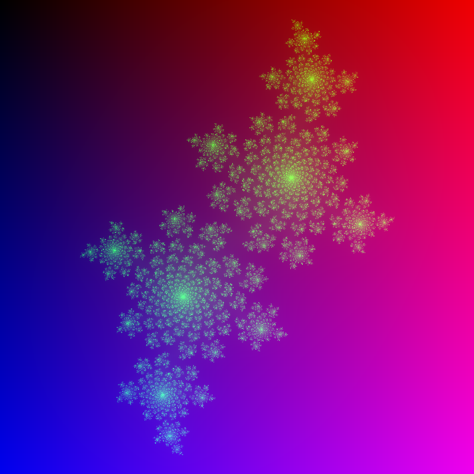

# Image
[](https://crates.io/crates/image)
[](https://docs.rs/image)
[](https://github.com/image-rs/image/actions)
[](https://gitter.im/image-rs/image?utm_source=badge&utm_medium=badge&utm_campaign=pr-badge)

Maintainers: [@HeroicKatora](https://github.com/HeroicKatora), [@fintelia](https://github.com/fintelia)

[How to contribute](https://github.com/image-rs/organization/blob/master/CONTRIBUTING.md)

## An Image Processing Library

This crate provides basic image processing functions and methods for converting to and from various image formats.

All image processing functions provided operate on types that implement the `GenericImageView` and `GenericImage` traits and return an `ImageBuffer`.

## High level API

Load images using [`ImageReader`]:

```rust,ignore
use std::io::Cursor;
use image::ImageReader;

let img = ImageReader::open("myimage.png")?.decode()?;
let img2 = ImageReader::new(Cursor::new(bytes)).with_guessed_format()?.decode()?;
```

And save them using [`save`] or [`write_to`] methods:

```rust,ignore
img.save("empty.jpg")?;

let mut bytes: Vec<u8> = Vec::new();
img2.write_to(&mut Cursor::new(&mut bytes), image::ImageFormat::Png)?;
```

## Supported Image Formats

With default features enabled, `image` provides implementations of many common
image format encoders and decoders.

<!--- NOTE: Make sure to keep this table in sync with the one in src/lib.rs -->

| Format   | Decoding                                  | Encoding                                |
| -------- | ----------------------------------------- | --------------------------------------- |
| AVIF     | Yes \*                                    | Yes (lossy only)                        |
| BMP      | Yes                                       | Yes                                     |
| DDS      | Yes                                       | ---                                     |
| Farbfeld | Yes                                       | Yes                                     |
| GIF      | Yes                                       | Yes                                     |
| HDR      | Yes                                       | Yes                                     |
| ICO      | Yes                                       | Yes                                     |
| JPEG     | Yes                                       | Yes                                     |
| EXR      | Yes                                       | Yes                                     |
| PNG      | Yes                                       | Yes                                     |
| PNM      | Yes                                       | Yes                                     |
| QOI      | Yes                                       | Yes                                     |
| TGA      | Yes                                       | Yes                                     |
| TIFF     | Yes                                       | Yes                                     |
| WebP     | Yes                                       | Yes (lossless only)                     |

- \* Requires the `avif-native` feature, uses the libdav1d C library.

## Image Types

This crate provides a number of different types for representing images.
Individual pixels within images are indexed with (0,0) at the top left corner.

### [`ImageBuffer`](https://docs.rs/image/*/image/struct.ImageBuffer.html)
An image parameterised by its Pixel type, represented by a width and height and
a vector of pixels. It provides direct access to its pixels and implements the
`GenericImageView` and `GenericImage` traits.

### [`DynamicImage`](https://docs.rs/image/*/image/enum.DynamicImage.html)
A `DynamicImage` is an enumeration over all supported `ImageBuffer<P>` types.
Its exact image type is determined at runtime. It is the type returned when
opening an image. For convenience `DynamicImage` reimplements all image
processing functions.

### The [`GenericImageView`](https://docs.rs/image/*/image/trait.GenericImageView.html) and [`GenericImage`](https://docs.rs/image/*/image/trait.GenericImage.html) Traits

Traits that provide methods for inspecting (`GenericImageView`) and manipulating (`GenericImage`) images, parameterised over the image's pixel type.

### [`SubImage`](https://docs.rs/image/*/image/struct.SubImage.html)
A view into another image, delimited by the coordinates of a rectangle.
The coordinates given set the position of the top left corner of the rectangle.
This is used to perform image processing functions on a subregion of an image.


## The [`ImageDecoder`](https://docs.rs/image/*/image/trait.ImageDecoder.html) and [`ImageDecoderRect`](https://docs.rs/image/*/image/trait.ImageDecoderRect.html) Traits

All image format decoders implement the `ImageDecoder` trait which provide
basic methods for getting image metadata and decoding images. Some formats
additionally provide `ImageDecoderRect` implementations which allow for
decoding only part of an image at once.

The most important methods for decoders are...
+ **dimensions**: Return a tuple containing the width and height of the image.
+ **color_type**: Return the color type of the image data produced by this decoder.
+ **read_image**: Decode the entire image into a slice of bytes.

## Pixels

`image` provides the following pixel types:
+ **Rgb**: RGB pixel
+ **Rgba**: RGB with alpha (RGBA pixel)
+ **Luma**: Grayscale pixel
+ **LumaA**: Grayscale with alpha

All pixels are parameterised by their component type.

## Image Processing Functions

These are the functions defined in the [`imageops`](https://docs.rs/image/latest/image/imageops/index.html) module. All functions operate on types that implement the [`GenericImage`](https://docs.rs/image/latest/image/trait.GenericImage.html) trait.
Note that some of the functions are very slow in debug mode. Make sure to use release mode if you experience any performance issues.

+ [**blur**](https://docs.rs/image/latest/image/enum.DynamicImage.html#method.blur): Performs a Gaussian blur on the supplied image.
+ [**brighten**](https://docs.rs/image/latest/image/enum.DynamicImage.html#method.brighten): Brighten the supplied image.
+ [**huerotate**](https://docs.rs/image/latest/image/enum.DynamicImage.html#method.huerotate): Hue rotate the supplied image by degrees.
+ [**contrast**](https://docs.rs/image/latest/image/enum.DynamicImage.html#method.adjust_contrast): Adjust the contrast of the supplied image.
+ [**crop**](https://docs.rs/image/latest/image/enum.DynamicImage.html#method.crop): Return a mutable view into an image.
+ [**filter3x3**](https://docs.rs/image/latest/image/enum.DynamicImage.html#method.filter3x3): Perform a 3x3 box filter on the supplied image.
+ [**flip_horizontal**](https://docs.rs/image/latest/image/enum.DynamicImage.html#method.fliph): Flip an image horizontally.
+ [**flip_vertical**](https://docs.rs/image/latest/image/enum.DynamicImage.html#method.flipv): Flip an image vertically.
+ [**grayscale**](https://docs.rs/image/latest/image/enum.DynamicImage.html#method.grayscale): Convert the supplied image to grayscale.
+ [**invert**](https://docs.rs/image/latest/image/enum.DynamicImage.html#method.invert): Invert each pixel within the supplied image This function operates in place.
+ [**resize**](https://docs.rs/image/latest/image/enum.DynamicImage.html#method.resize): Resize the supplied image to the specified dimensions.
+ [**rotate180**](https://docs.rs/image/latest/image/enum.DynamicImage.html#method.rotate180): Rotate an image 180 degrees clockwise.
+ [**rotate270**](https://docs.rs/image/latest/image/enum.DynamicImage.html#method.rotate270): Rotate an image 270 degrees clockwise.
+ [**rotate90**](https://docs.rs/image/latest/image/enum.DynamicImage.html#method.rotate90): Rotate an image 90 degrees clockwise.
+ [**unsharpen**](https://docs.rs/image/latest/image/enum.DynamicImage.html#method.unsharpen): Performs an unsharpen mask on the supplied image.

For more options, see the [`imageproc`](https://crates.io/crates/imageproc) crate.

## Examples
### Opening and Saving Images

`image` provides the [`open`](https://docs.rs/image/latest/image/fn.open.html) function for opening images from a path.  The image
format is determined from the path's file extension. An `io` module provides a
reader which offer some more control.

```rust,no_run
use image::GenericImageView;

// Use the open function to load an image from a Path.
// `open` returns a `DynamicImage` on success.
let img = image::open("tests/images/jpg/progressive/cat.jpg").unwrap();

// The dimensions method returns the images width and height.
println!("dimensions {:?}", img.dimensions());

// The color method returns the image's `ColorType`.
println!("{:?}", img.color());

// Write the contents of this image to the Writer in PNG format.
img.save("test.png").unwrap();
```

### Generating Fractals

```rust,no_run
//! An example of generating julia fractals.
let imgx = 800;
let imgy = 800;

let scalex = 3.0 / imgx as f32;
let scaley = 3.0 / imgy as f32;

// Create a new ImgBuf with width: imgx and height: imgy
let mut imgbuf = image::ImageBuffer::new(imgx, imgy);

// Iterate over the coordinates and pixels of the image
for (x, y, pixel) in imgbuf.enumerate_pixels_mut() {
    let r = (0.3 * x as f32) as u8;
    let b = (0.3 * y as f32) as u8;
    *pixel = image::Rgb([r, 0, b]);
}

// A redundant loop to demonstrate reading image data
for x in 0..imgx {
    for y in 0..imgy {
        let cx = y as f32 * scalex - 1.5;
        let cy = x as f32 * scaley - 1.5;

        let c = num_complex::Complex::new(-0.4, 0.6);
        let mut z = num_complex::Complex::new(cx, cy);

        let mut i = 0;
        while i < 255 && z.norm() <= 2.0 {
            z = z * z + c;
            i += 1;
        }

        let pixel = imgbuf.get_pixel_mut(x, y);
        let image::Rgb(data) = *pixel;
        *pixel = image::Rgb([data[0], i as u8, data[2]]);
    }
}

// Save the image as “fractal.png”, the format is deduced from the path
imgbuf.save("fractal.png").unwrap();
```

Example output:



### Writing raw buffers
If the high level interface is not needed because the image was obtained by other means, `image` provides the function [`save_buffer`](https://docs.rs/image/latest/image/fn.save_buffer.html) to save a buffer to a file.

```rust,no_run
let buffer: &[u8] = unimplemented!(); // Generate the image data

// Save the buffer as "image.png"
image::save_buffer("image.png", buffer, 800, 600, image::ExtendedColorType::Rgb8).unwrap()
```
